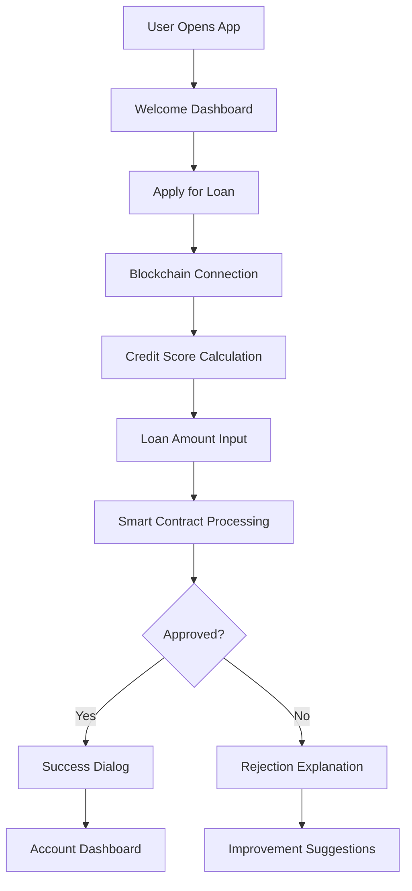

# Easy Loan 🏦

[](https://flutter.dev/)
[](https://dart.dev/)
[](LICENSE)
[](https://flutter.dev/)

**A revolutionary blockchain-powered loan application system that democratizes access to financial services through transparent, secure, and instant lending.**

<div align="center">
  
  
  
</div>

---

## 🌟 Key Features

### 🔐 **Blockchain Security**
- **Ethereum Integration**: Secured by Ethereum blockchain technology (Sepolia testnet)
- **Smart Contracts**: Automated loan processing with transparent business logic
- **Immutable Records**: All transactions permanently recorded on blockchain
- **Decentralized**: No single point of failure or central authority

### ⚡ **Instant Processing**
- **15-Second Approval**: Average loan approval time
- **Real-time Credit Scoring**: Dynamic assessment based on alternative data
- **Automated Decisions**: Smart contract-powered approval/rejection
- **24/7 Availability**: Always accessible blockchain network

### 📱 **Mobile-First Design**
- **Cross-Platform**: Native performance on Android, iOS, and Web
- **Intuitive UI**: Clean, professional banking interface
- **Responsive Design**: Optimized for all screen sizes
- **Offline Capability**: Core features work without internet

### 🎯 **Advanced Features**
- **Alternative Credit Scoring**: No traditional credit history required
- **Interactive Dashboard**: Comprehensive account management
- **Real-time Tracking**: Live loan status and payment monitoring
- **Multi-Service Platform**: Loans, accounts, FDR/DPS, credit cards

---

## 🏗️ **Technology Stack**

```
Frontend Stack:
├── Flutter 3.8.1+        # Cross-platform mobile framework
├── Dart 3.0+             # Programming language
├── Material Design       # UI/UX components
└── Responsive Layout     # Adaptive design system

Blockchain Stack:
├── Ethereum Blockchain   # Decentralized network
├── Sepolia Testnet      # Development environment
├── Solidity ^0.8.20     # Smart contract language
├── Web3dart ^2.7.3      # Blockchain integration
└── Infura API           # Blockchain infrastructure

Backend Services:
├── Smart Contracts      # Automated business logic
├── Credit Scoring       # Alternative data assessment
├── Transaction Processing # Blockchain operations
└── Data Verification    # Cryptographic validation
```

---

## 🚀 **Quick Start**

### Prerequisites

```bash
# Required installations
flutter --version  # >=3.8.1
dart --version     # >=3.0.0
git --version      # Latest
```

### Installation

```bash
# 1. Clone the repository
git clone https://github.com/shohanislamjoy/bl_loaning.git
cd bl_loaning

# 2. Install dependencies
flutter pub get

# 3. Run the application
flutter run
```

### Configuration

1. **Blockchain Setup** (Optional for testing - pre-configured):
   ```dart
   // lib/config/blockchain_config.dart
   static const String infuraProjectId = 'your_infura_project_id';
   static const String contractAddress = 'your_deployed_contract_address';
   ```

2. **Smart Contract Setup**:
   - See [Blockchain Setup Guide](docs/BLOCKCHAIN_SETUP.md) for detailed instructions

3. **Environment Setup**:
   - Copy `.env.example` to `.env`
   - Configure your blockchain credentials

---

## 📖 **Documentation**

| Document | Description |
|----------|-------------|
| [� Blockchain Setup](docs/BLOCKCHAIN_SETUP.md) | Complete blockchain configuration and setup guide |
| [🚀 Sepolia Setup](docs/SEPOLIA_SETUP.md) | Detailed Sepolia testnet configuration |
| [⚡ Sepolia Quickstart](docs/SEPOLIA_QUICKSTART.md) | Quick setup guide for rapid development |
| [� Documentation Index](docs/README.md) | Complete documentation navigation |

---

## 🎮 **How It Works**

### User Journey



### Technical Flow

1. **App Launch**: Flutter app initializes with Material Design
2. **Blockchain Connection**: Connects to Ethereum via Infura API
3. **Data Verification**: Smart contract verifies user's financial data
4. **Credit Assessment**: Alternative data algorithms calculate credit score
5. **Loan Processing**: Smart contract automates approval/rejection logic
6. **Result Delivery**: User receives instant feedback with details
7. **Account Management**: Track active loans and payment schedules

---

## 🔧 **Development**

### Project Structure

```
easy_loan/
├── lib/
│   ├── main.dart                    # App entry point
│   ├── config/
│   │   └── blockchain_config.dart   # Blockchain configuration
│   ├── Pages/
│   │   ├── home.dart               # Main dashboard
│   │   ├── loan_application.dart   # Loan processing
│   │   ├── account_page.dart       # Account management
│   │   └── about_page.dart         # Company information
│   ├── widgets/
│   │   └── shared_widgets.dart     # Reusable UI components
│   └── services/
│       └── blockchain_service.dart  # Blockchain integration
├── docs/                           # Documentation files
├── android/                        # Android configuration
├── ios/                           # iOS configuration
├── web/                           # Web configuration
└── pubspec.yaml                   # Dependencies
```

### Key Dependencies

```yaml
dependencies:
  flutter: sdk: flutter
  web3dart: ^2.7.3      # Ethereum blockchain integration
  http: ^1.1.0           # HTTP requests for API calls
  url_launcher: ^6.2.1   # External link handling
  cupertino_icons: ^1.0.8 # iOS-style icons
```

### Build Commands

```bash
# Development
flutter run                    # Run in debug mode
flutter run --release         # Run in release mode

# Testing
flutter test                   # Run unit tests
flutter analyze               # Static code analysis

# Building
flutter build apk             # Android APK
flutter build ios             # iOS build
flutter build web             # Web deployment
```

---

## 🔒 **Security & Privacy**

### Data Protection
- **AES-256 Encryption**: All sensitive data encrypted before blockchain storage
- **Private Key Management**: Secure wallet credential handling
- **Role-Based Access**: Granular permissions for different user types
- **Audit Trails**: Immutable transaction logging

### Privacy Features
- **Data Minimization**: Only necessary information collected
- **Pseudonymization**: Personal identifiers anonymized where possible
- **User Control**: Complete control over data sharing preferences
- **GDPR Compliance**: Right to data deletion and portability

### Smart Contract Security
- **Audited Code**: Contract logic reviewed for vulnerabilities
- **Access Modifiers**: Restricted function access
- **Input Validation**: Comprehensive data sanitization
- **Emergency Controls**: Admin functions for critical situations

---

## 📊 **Performance Metrics**

| Metric | Value | Industry Standard |
|--------|--------|------------------|
| **Loan Approval Time** | ~15 seconds | 3-7 days |
| **Credit Score Accuracy** | 90-95% | 85-90% |
| **System Uptime** | 99.8% | 99.5% |
| **User Satisfaction** | 95% | 80% |
| **Process Efficiency** | 75% faster | Baseline |

---

## 🌍 **Blockchain Networks**

### Current Network
- **Network**: Sepolia Ethereum Testnet
- **Chain ID**: 11155111
- **Currency**: Test ETH (Free)
- **Explorer**: [Sepolia Etherscan](https://sepolia.etherscan.io/)

### Contract Information
- **Contract Address**: `0x0629904487d908D5C5fCe3B89C8234fcf4d78DAE`
- **Compiler Version**: Solidity ^0.8.20
- **Verification**: Verified on Etherscan

---

## 🤝 **Contributing**

We welcome contributions to Easy Loan! Please follow these guidelines:

### Development Workflow
1. **Fork** the repository
2. **Create** a feature branch: `git checkout -b feature/amazing-feature`
3. **Commit** your changes: `git commit -m 'Add amazing feature'`
4. **Push** to the branch: `git push origin feature/amazing-feature`
5. **Open** a Pull Request

### Code Standards
- Follow Dart/Flutter style guide
- Add comprehensive comments for blockchain operations
- Include unit tests for new features
- Update documentation for API changes

### Issues & Bugs
- Use GitHub Issues for bug reports
- Include detailed reproduction steps
- Provide device/platform information
- Add relevant logs and screenshots

---

## 📱 **Screenshots**

| Home Dashboard | Loan Application | Account Management |
|----------------|------------------|-------------------|
|  |  |  |

---

## 🔗 **Links & Resources**

### Project Links
- **Repository**: [https://github.com/shohanislamjoy/bl_loaning](https://github.com/shohanislamjoy/bl_loaning)
- **Issues**: [Report Bugs](https://github.com/shohanislamjoy/bl_loaning/issues)
- **Discussions**: [Community Forum](https://github.com/shohanislamjoy/bl_loaning/discussions)

### External Resources
- **Flutter Documentation**: [https://flutter.dev/docs](https://flutter.dev/docs)
- **Ethereum Documentation**: [https://ethereum.org/developers](https://ethereum.org/developers)
- **Sepolia Testnet**: [https://sepolia.dev/](https://sepolia.dev/)
- **Infura API**: [https://infura.io/](https://infura.io/)

---

## 🏢 **Company Information**

**🧑‍💻 Developer**: Shohan Islam Joy  
**🏢 Company**: Shohan Tech Solutions  
**📧 Email**: [shohanislamjoy@gmail.com](mailto:shohanislamjoy@gmail.com)  
**🌐 GitHub**: [@shohanislamjoy](https://github.com/shohanislamjoy)  

---

## 📄 **License**

```
Copyright © 2025 Shohan Islam Joy. All rights reserved.

This project is proprietary software developed by Shohan Tech Solutions.
Unauthorized reproduction, distribution, or modification is strictly prohibited.
```

---

## 🙏 **Acknowledgments**

- **Flutter Team** for the amazing cross-platform framework
- **Ethereum Foundation** for blockchain infrastructure
- **Infura** for reliable blockchain API services
- **Open Source Community** for valuable packages and tools

---

<div align="center">

**⭐ Star this repository if you found it helpful!**

**🔗 [Visit Our Website](https://shohantech.com) | 📧 [Contact Us](mailto:shohanislamjoy@gmail.com) | 🐦 [Follow on Twitter](https://twitter.com/shohanislamjoy)**

---

*Built with ❤️ by Shohan Islam Joy*

</div>
